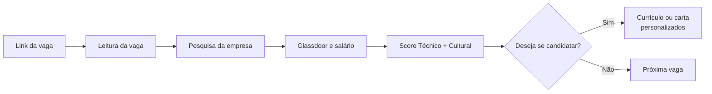

# 🔎 Assistente de Carreira com IA

> Uma consultora de carreira construída com IA generativa que analisa a vaga **antes** da candidatura e responde: *vale a pena investir meu tempo nessa vaga?*

Projeto pessoal de **Maria Victor**, construído com **Claude (Anthropic), Claude Projects e engenharia de prompt**.

---

## 💡 O que ele faz

A partir do link de uma vaga, o assistente segue um fluxo fixo:



```
flowchart LR
    A[Link da vaga] --> B[Leitura da vaga]
    B --> C[Identificar empresa, cargo,<br/>senioridade, localização e modalidade]
    C --> D[Extrair responsabilidades,<br/>requisitos, diferenciais e stack]
    D --> E[Identificar palavras-chave ATS]
    E --> F{É Gupy?}

    F --> G[Pesquisa da empresa]
    G --> H[Site + Trabalhe Conosco]
    H --> I[Missão, visão, valores<br/>e cultura]
    I --> J[LinkedIn da empresa]

    J --> K[Glassdoor]
    K --> L[Avaliações, cultura,<br/>ambiente e equilíbrio]
    L --> M[Faixa salarial]

    M --> N[Match]
    N --> O[Score Técnico]
    N --> P[Score Cultural]
    O --> Q[Score Geral]
    P --> Q
    Q --> R[(Técnico × 1 + Cultural × 3) ÷ 4]

    R --> S[Análise da vaga]
    S --> T[Pontos fortes + Gaps técnicos<br/>+ Alertas culturais]
    T --> U[Faixa salarial + ATS<br/>+ Perfil da vaga]
    U --> V[Perfil investigativo<br/>da função]
    V --> W{Deseja se candidatar?}

    W -- Não --> X[Próxima vaga]
    W -- Sim --> Y{É Gupy?}

    Y -- Sim --> Z[Carta de apresentação<br/>1.500 caracteres]
    Z --> AA[Destacar 3 principais<br/>tecnologias/competências]
    AA --> AB[Explicar aderência<br/>com o currículo]

    Y -- Não --> AC[Currículo personalizado]
    AC --> AD[Usar currículo ATS<br/>+ Profile_4]
    AD --> AE[Adaptar experiências,<br/>resultados e palavras-chave]
    AE --> AF[Currículo ATS<br/>máx. 2 páginas]

    AB --> AG[Finalizar candidatura]
    AF --> AG

Score Geral = (Técnico × 1 + Cultural × 3) ÷ 4

≥ 65%   → Vai nessa! 🚀
45–64%  → Vai por sua conta e risco ⚠️
< 45%   → Corre que é cilada! 🚨
```

## ⏱️ Por que eu criei

- **Economizo tempo** analisando cada vaga e gerando um currículo (ou carta) específico para ela.
- **Aposto nas vagas certas** para a minha experiência e o meu perfil, em vez de me candidatar em volume.
- **A decisão final é sempre minha:** o assistente para depois da análise e só gera o currículo se eu disser "sim".
- **Nada é inventado:** se falta informação, ele avisa em vez de preencher.

O prompt passou por **várias versões** até chegar a este formato, ajustando critérios, pesos e regras conforme eu usava no dia a dia.

## 📂 Arquivos de referência (privados)

O assistente se apoia em materiais que eu construí com acompanhamento profissional. Eles **não estão publicados** aqui por conterem dados pessoais, mas é importante saber de onde vêm:

| Arquivo | O que é | Origem |
|---|---|---|
| **Currículo mestre** | Histórico completo de experiências, projetos e resultados | É o perfil completo do LinkedIn em PDF |
| **Currículo ATS** | Versão otimizada para sistemas de triagem automática (ATS) | Construído com um mentor de carreira |
| **Perfil DISC** | Modelo comportamental que descreve como a pessoa age no trabalho a partir de quatro fatores: Dominância, Influência, Estabilidade e Conformidade | Teste da Intermetrics, analisado com um mentor de carreira |
| **Motivadores** | O que me dá energia e sentido no trabalho | Teste da Intermetrics, analisado com um mentor de carreira |
| **Sabotadores** | Padrões mentais que me tiram do meu melhor, baseados no livro *Inteligência Positiva* | Analisado com um mentor de carreira |

É por isso que a **cultura pesa 3x mais** que a parte técnica no score: o perfil comportamental não é um palpite da IA, é um diagnóstico feito com especialistas.

## 📁 Estrutura

```
├── prompt/
│   └── assistente-de-carreira.md   # o prompt completo
└── exemplos/
    └── exemplo-analise.md          # uma análise real, anonimizada
```

## 🛠️ Stack

`Claude (Anthropic)` · `Claude Projects` · `Engenharia de prompt` · `Busca web` · `Otimização para ATS`

---

**Maria Victor** · Analista de Dados · MBA em Analytics & IA (FIA)
